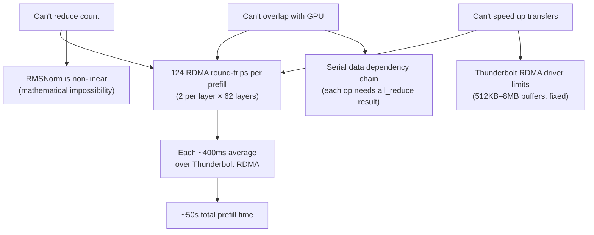

# TP All-Reduce Optimization: Full Investigation Report

**Date**: Feb 22–23, 2026  
**Starting commit**: `3302cc30` (feat: add dedup, value-weighted eviction, volatile detection, and warmup caching)  
**Ending commit**: `854c2c2a` (revert: all_gather optimization)  
**Scope**: 40 commits in `exo`, 17 commits in `mlx`, 2 commits in `mlx-lm`  
**Result**: All optimization paths exhausted — prefill is hardware-bound by Thunderbolt RDMA latency  

---

## Problem Statement

During Hybrid TP+PP inference with 3× M4 Macs (2 Mac Studios + 1 MacBook Pro) running the MiniMax-M2.5-5bit model (62 decoder layers), prefill of a 16K-token prompt takes **~50 seconds** on the TP pair — an order of magnitude slower than expected. TTFT had regressed from ~20s to ~90s after initial hybrid work, triggering this investigation.

Custom profiling instrumentation (`EXO_EVAL_DEBUG`) revealed:

| Metric | Value |
|--------|-------|
| **total** | 49,710ms |
| **gpu_eval** | 285.8ms (5906 ops) |
| **cpu_eval** | 6.9ms (186 ops) |
| **sched_wait** | **49,405ms** (1512 task stalls) |
| **fence_wait** | 0.0ms |

**99.4% of time** is spent in `sched_wait` — the GPU sitting idle while CPU-dispatched RDMA all-reduce operations complete over Thunderbolt.

---

## Phase 0: Prefill Debugging & PP Coordination (before TP-specific work)

Before isolating the RDMA bottleneck, significant work went into debugging the overall prefill pipeline. This phase eliminated several red herrings and produced the tooling used for subsequent investigation.

### Prefill Stall Instrumentation

```
1b3d031e perf: reduce decode/prefill overhead from logging and per-step work
c128a750 perf: defer KV quantization from prefill to pre-decode
3037258e Revert "perf: defer KV quantization from prefill to pre-decode"
7a678fb2 diag: add per-phase timing to _step and PREFILL→DECODE gap
bef6973e diag: instrument prefill loop to find hidden 11.3s stall
b0a9edce perf: eliminate 11.4s deepcopy stall during prefill callback
7c9590cb diag: split log+callback timer into loguru vs callback sub-phases
```

**Found & fixed**: An 11.4s `deepcopy` stall in the prefill callback was consuming ~20% of total time. KV quantization deferral was attempted but reverted — it didn't help.

### PP Pipeline Coordination & Barrier Optimization

```
dfa9e52f perf: remove distributed barrier from prefill progress callback
a58ede3e revert: restore mx_any barrier — required for PP pipeline sync
2e5ac0a5 perf: pipeline prefill chunks to hide PP tail latency
9049829e perf: skip mx_any barrier for intermediate prefill chunks
2cf4e85c revert: restore 512K prefill step size — multi-chunk was slower
f7429dae perf: minimize PP tail layers for pipeline sync
```

**Found**: The `mx_any` distributed barrier is required for PP pipeline synchronization. Removing it saved ~11s but broke multi-node coordination. Multi-chunk pipelining was tried but slower.

### Layer Split Tuning & GPU Timeout Prevention

```
7d555239 fix: use 58/4 layer split — 61/1 caused GPU timeout
1f6dd552 feat: add PP coordination signal to prevent GPU timeout
b83450fd fix: revert coordination signal (deadlock) + revert to 58/4 split
12077804 feat: chunked prefill for hybrid pipeline GPU timeout safety
1766e349 fix: use _hybrid_pipeline_group for prefill chunking detection
4ef4dff7 fix: restore force-eval + 58/4 split, keep chunked prefill
641cf610 perf: revert to 61/1 split, rely on chunked prefill for timeout safety
bed0b381 revert: restore original memory-proportional layer split
bb2abac0 perf: increase hybrid prefill chunk to 16K tokens
eda971f6 revert: remove chunked prefill guard entirely
f9cee3c2 perf: remove mx_any barrier from prefill callback — saves 11s
87af6daa fix: restore mx_any barrier — required for PP prefill/decode sync
```

**Found**: 61/1 layer splits caused GPU timeout on the tail PP node. Coordination signals caused deadlocks. 58/4 split was stable. Chunked prefill was introduced for timeout safety but later reverted when TP analysis began.

### Transition to TP-Specific Investigation

```
5e725461 feat: add pure TP performance instrumentation
0cc352fa perf(tp): remove redundant sum_gradients + enable GPU-stream distributed ops
1afefe83 debug: add EXO_EVAL_DEBUG C++ eval timing + env passthrough
005d8bbc perf: configurable MAX_ACTIVE_TASKS + env passthrough
```

Added C++-level eval profiling (`EXO_EVAL_DEBUG`) and configurable `MAX_ACTIVE_TASKS`, which produced the data showing 99.4% time in `sched_wait`. This is when the investigation pivoted to TP-specific RDMA optimization.

---

## Architecture: What Actually Happens Per Layer

```mermaid
graph LR
    X["x (full hidden state)"] --> LN1["input_layernorm\n(regular RMSNorm)"]
    LN1 --> QKV["Q/K/V proj\n(AllToSharded)"]
    QKV --> QN["q/k_norm\n(ShardedRMSNorm)"]
    QN -->|"all_sum ①②\nscalar"| SDPA["Self-Attention"]
    SDPA --> OPROJ["o_proj\n(ShardedToAll)"]
    OPROJ -->|"❌ all_sum ③\n~95MB RDMA"| RES1["x + attn_out"]
    RES1 --> LN2["post_attn_layernorm\n(regular RMSNorm)"]
    LN2 --> MOE["MoE Block"]
    MOE -->|"❌ all_sum ④\n~95MB RDMA"| RES2["r + moe_out"]
    
    style OPROJ fill:#f55,stroke:#333,color:#fff
    style MOE fill:#f55,stroke:#333,color:#fff
```



**Corrected count**: 2 large all-reduces per layer × 62 layers = **124 RDMA round-trips** per prefill. Each transfers ~95MB over Thunderbolt RDMA, averaging ~400ms per round-trip.

---

## Optimization Attempts: Complete History

### 1. ❌ Eliminate o_proj All-Reduce (Mathematical Impossibility)

**Goal**: Skip the all-reduce after `o_proj`, defer aggregation to the MoE block.

**Investigation**: Traced the Megatron-LM column-parallel pattern. Discovered it only eliminates the all-reduce in the **backward pass** (training), not forward pass (inference).

**Root cause**: `post_attention_layernorm` (RMSNorm) sits between the two all-reduces. RMSNorm is **non-linear**:

```
||partial_0||² + ||partial_1||² ≠ ||partial_0 + partial_1||²
```

Cross terms `2·a·b` are missing. Computing RMSNorm on partial sums produces incorrect normalization → wrong MoE gate routing → garbage output. No mathematical trick can work around this.

**Three sub-approaches explored, all failed**:

- Skip all_reduce, defer to MoE → RMSNorm breaks
- All_reduce only the gate scores → normalization still wrong  
- Column-split o_proj output → requires retraining with different weight partitioning

---

### 2. ❌ Chunked Prefill (~12 commits, reverted)

**Goal**: Break 16K prefill into smaller chunks to reduce per-transfer tensor size.

**Commits** (exo repo):

```
12077804 feat: chunked prefill for hybrid pipeline GPU timeout safety
bb2abac0 perf: increase hybrid prefill chunk to 16K tokens
eda971f6 revert: remove chunked prefill guard entirely
38d3b51d perf: auto-reduce prefill chunk size for TP mode
1a48514f revert: TP chunking (made things worse), keep env passthrough
```

**Result**: Made things worse. Smaller chunks mean more round-trips with overhead per chunk. The total RDMA transfer volume is the same, but the per-chunk scheduling overhead adds up. **Reverted.**

---

### 3. ❌ Increase RDMA Buffer Size (~5 commits, hit driver limits)

**Goal**: Increase JACCL's RDMA buffer from 512KB to reduce chunking within each all-reduce.

**Commits** (mlx repo):

```
6ec0af6a perf: increase JACCL RDMA buffer from 512KB to 8MB
8a2d91a0 perf: 32MB RDMA buffers → driver segfault
dacdad2a fix: revert to 8MB (32MB exceeded driver limits)
4c828e10 perf: try 2MB max RDMA buffer
942b7b2e perf: 8-deep RDMA pipeline (was 2)
779779b9 fix: NUM_BUFFERS 8→4 (128 MRs segfaulted driver)
```

**Result**: Thunderbolt RDMA driver on macOS has hard limits:

- Max buffer ~8MB before instability
- 32MB causes driver segfault
- Too many Memory Regions (MRs) also segfaults
- 8-deep pipeline with 4 buffers was stable but **no faster**

---

### 4. ❌ GPU-Stream Distributed Ops (deadlock)

**Goal**: Route distributed ops through GPU stream instead of CPU stream to eliminate GPU→CPU→GPU fence transitions.

**Commits** (mlx repo):

```
b9426dda perf: delegate distributed eval_gpu to eval_cpu for Apple Silicon
647fa7ad revert: restore blocking scheduler (non-blocking causes GPU timeout)
93db139c perf: non-blocking scheduler for task-count throttle
```

**Result**: GPU timeout / deadlock. The RDMA operations can't run on the GPU — they require CPU-side `ibv_post_send`/`ibv_post_recv` calls. **Reverted.**

---

### 5. ❌ All-Gather + Local GPU Reduce (deployed, no improvement)

**Goal**: Replace `mx.distributed.all_sum()` (CPU-side reduce during RDMA) with `mx.distributed.all_gather()` + `mx.sum()` (GPU-side reduce after RDMA).

**Commits**:

```
mlx:    811cdcda perf: replace all_sum with all_gather + GPU reduce
mlx-lm: 74917d1 perf: replace MoE all_sum with all_gather + GPU reduce

mlx:    6cb5542d Revert (no improvement)
mlx-lm: cc7d8eb  Revert (no improvement)
```

**Deployed and benchmarked on cluster**. Results:

| Metric | Baseline (all_sum) | All-Gather + Sum |
|--------|-------------------|------------------|
| total | ~49,700ms | 49,710ms |
| sched_wait | ~49,400ms | 49,405ms |

**No measurable difference**. The CPU-side reduction in `SumOp` was not the bottleneck — the RDMA transfer time itself is. **Reverted.**

---

### 6. ❌ Async/Overlapped All-Reduce (analyzed, proven infeasible)

**Goal**: Overlap RDMA transfer with GPU compute so GPU doesn't stall.

**Analysis** (no code attempted — proven infeasible in analysis):

The decoder layer is:

```python
r = x + self.self_attn(self.input_layernorm(x), mask, cache)    # all_reduce inside
r = r + self.block_sparse_moe(self.post_attention_layernorm(r))  # all_reduce inside
```

Each all_reduce result is a **direct data dependency** for the very next operation. The next layer needs the previous layer's output. There is **zero GPU compute that can run in parallel** with any RDMA transfer because every subsequent GPU operation depends on the transfer result.

Also confirmed that `MLX_METAL_FAST_SYNCH` is **not** async overlap — it's a lower-level GPU↔CPU fence mechanism (atomic polling vs `MTL::SharedEvent`).

---

### 7. ❌ Float8 Compression (ruled out)

**Goal**: Halve each 95MB transfer to ~47.5MB using float8 quantization.

**Decision**: Ruled out. The model is already 5-bit quantized. Adding lossy float8 compression on top of 5-bit weights would compound quantization error unacceptably.

---

## Root Cause: Why Nothing Works



The 50-second prefill is the **fundamental cost** of running TP across Thunderbolt-connected Macs with RDMA. The bottleneck is:

1. **124 sequential blocking RDMA operations** that cannot be reduced (non-linear RMSNorm prevents elimination)
2. **Cannot be overlapped** with GPU compute (serial data dependency chain)
3. **Cannot be made faster** (Thunderbolt RDMA driver buffer limits, already at maximum stable size)

## What Would Actually Help

| Change | Impact | Feasibility |
|--------|--------|-------------|
| Apple increases RDMA buffer limits in driver | High | Out of our control |
| Thunderbolt 5 with faster RDMA | High | Hardware upgrade |
| Model architecture without inter-layer layernorm | High | Requires different model |
| Pure Pipeline Parallelism (no TP) | Eliminates RDMA | Already works, but lower TPS |
| Accept 50s TTFT, optimize decode TPS | Practical | Current best path |

## Lessons Learned

1. **Profile before optimizing**: `EXO_EVAL_DEBUG` immediately showed 99.4% of time in `sched_wait`, not GPU or CPU compute
2. **Not all all-reduces are equal**: Only 2 of the 4 per-layer calls are large (~95MB). The `ShardedRMSNorm` ones are scalar-sized
3. **Megatron-LM's optimization is training-only**: Their `f/g` conjugate pair skips the backward-pass all-reduce, not the forward-pass one
4. **CPU reduction is negligible**: Replacing `all_sum` with `all_gather` + GPU `sum` produced identical timing — the CPU `SumOp` loop adds essentially zero overhead vs RDMA transfer time
5. **Thunderbolt RDMA has hard limits**: 32MB buffers crash the driver, 8+ pipeline buffers exceed MR limits
